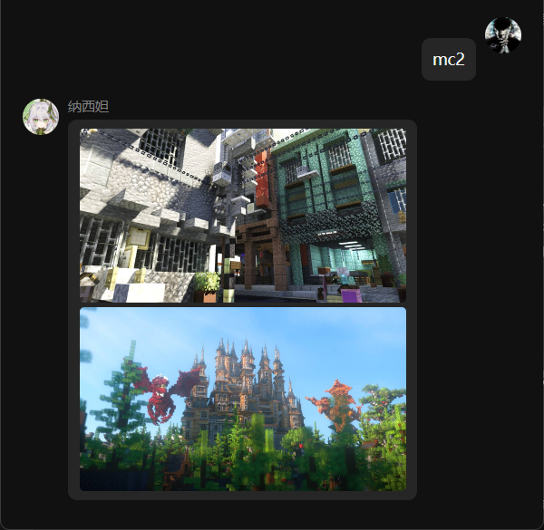

  
   
  

# nonebot-plugin-mcpic

_✨ 随机发送 MC 建筑图片 ✨_

## 📖 介绍

根据指令从爬好的数据库随机查询指定数量 MC 建筑图片链接下载并发送

支持直连，无需代理

[Demo](https://wlm3201.github.io/nonebot-plugin-mcpic/) (建议配合 [Sheas-Cealer](https://github.com/SpaceTimee/Sheas-Cealer))

## 💿 安装

使用 nb-cli 安装

在 nonebot2 项目的根目录下打开命令行, 输入以下指令即可安装

    nb plugin install nonebot-plugin-mcpic

使用包管理器安装

在 nonebot2 项目的插件目录下, 打开命令行, 根据你使用的包管理器, 输入相应的安装命令

pip

    pip install nonebot-plugin-mcpic

pdm

    pdm add nonebot-plugin-mcpic

poetry

    poetry add nonebot-plugin-mcpic

conda

    conda install nonebot-plugin-mcpic

打开 nonebot2 项目根目录下的 `pyproject.toml` 文件, 在 `[tool.nonebot]` 部分追加写入

    plugins = ["nonebot_plugin_mcpic"]

## 🎉 使用

### 指令表

mc|MC|建筑+图片数量

e.g: 建筑, mc20

### 效果图

